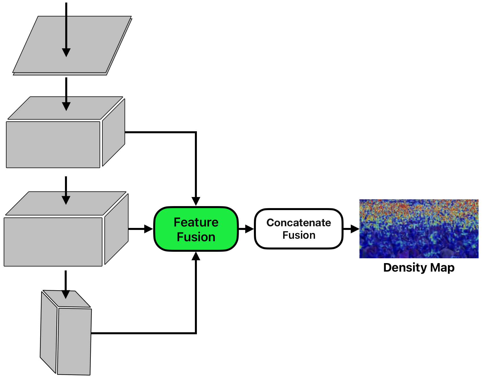
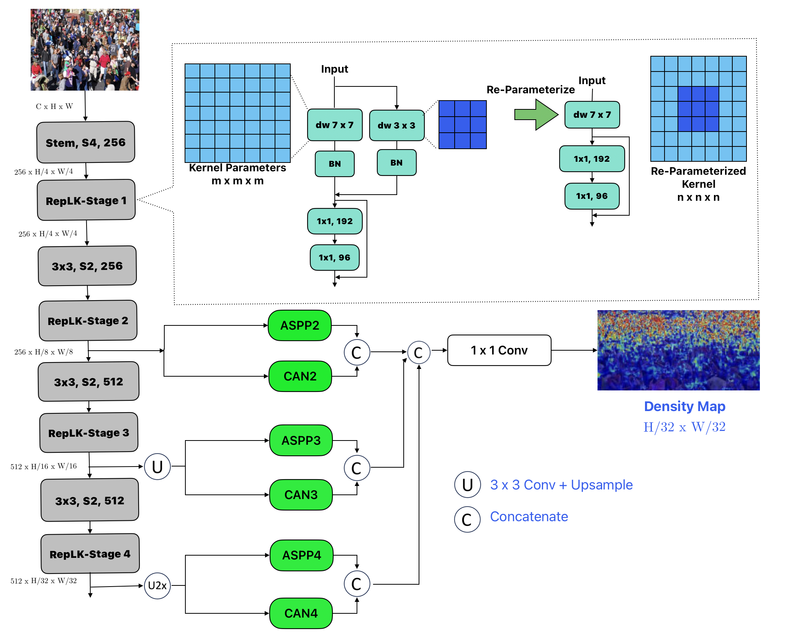
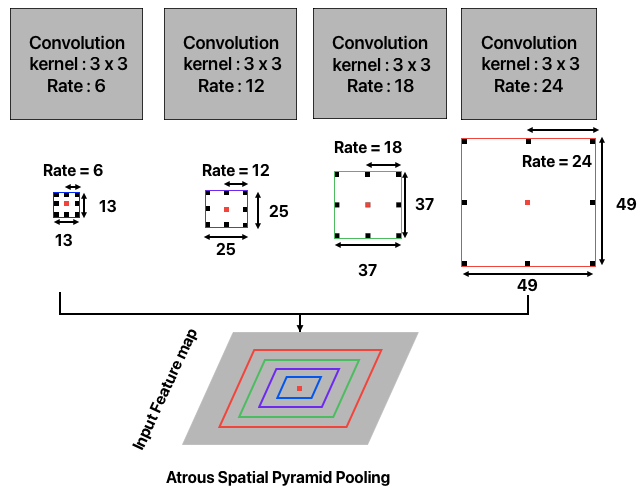

<div align="center">

# RepSFNet: A Single Fusion Network with Structural Reparameterization for Crowd Counting

**Mas Nurul Achmadiah**<sup>1</sup> &nbsp;&nbsp; **Chi-Chia Sun**<sup>2,\*</sup> &nbsp;&nbsp; **Wen-Kai Kuo**<sup>1</sup> &nbsp;&nbsp; **Jun-Wei Hsieh**<sup>3</sup>

<sup>1</sup>Department of Electro-Optical Engineering, National Formosa University, Yunlin, Taiwan<br>
<sup>2</sup>Department of Electrical Engineering, National Taipei University, New Taipei City, Taiwan<br>
<sup>3</sup>College of Artificial Intelligence and Green Energy, National Yang Ming Chiao Tung University, Hsinchu, Taiwan

[](https://ieeexplore.ieee.org/)
[](https://pytorch.org/)
[](LICENSE)

Official implementation — *IEEE International Conference on Advanced Video and Signal-Based Surveillance (AVSS), 2025*

</div>

---

## Abstract

Crowd counting remains challenging in variable-density scenes due to scale variations, occlusions, and the high computational cost of existing models. We propose **RepSFNet** (Reparameterized Single Fusion Network), a lightweight architecture for accurate and real-time crowd estimation. RepSFNet combines large-kernel convolutional power with an efficiency suitable for low-power edge computing. The architecture includes three components: (i) a **RepLK-ViT backbone** using large reparameterized kernels for efficient multi-scale feature extraction; (ii) a **Feature Fusion module** that integrates ASPP and CAN for robust, density-adaptive context modeling; and (iii) a **Concatenate Fusion module** to preserve spatial resolution and produce high-quality density maps. By avoiding attention mechanisms and multi-branch designs, RepSFNet reduces both parameters and FLOPs, enhancing runtime efficiency. The loss function combines Mean Absolute Error (MAE) and Optimal Transport (OT), further improving count accuracy. Experiments on ShanghaiTech, NWPU, and UCF-QNRF show that RepSFNet delivers competitive accuracy with **up to 34% lower inference latency** compared to P2PNet, M-SFANet, M-SegNet, STEERER, and Gramformer.

---

## Highlights

- **No attention, no multi-branch decoder.** A single fusion point per stage keeps the graph shallow and the latency low.
- **Structural reparameterization.** Large kernels (7×7 → 13×13) train with a parallel small kernel + BN, and collapse into *one* depth-wise kernel at inference — same output, fewer layers.
- **Density-adaptive context.** ASPP supplies fixed-scale context; CAN adds per-pixel adaptivity for perspective distortion and mixed densities.
- **26.06 M parameters, 62.59 G MACs, 10.42 ms @ 640×480** on an RTX 4070 Ti Super — the lowest of every model compared in the paper.
- **Best MAE/MSE on NWPU-Crowd** (46.23 / 132.58) among the compared methods.

---

## Architecture

### Single fusion design

Features from multiple backbone depths meet at **one** fusion module, which feeds a concatenate-fusion head that emits the density map. There is no cascaded decoder and no cross-attention anywhere in the graph.

<p align="center">
  <br>
  <em>Figure 1 — A simple single fusion network architecture.</em>
</p>

### Complete network

The backbone is a 4×4 stride-4 stem followed by four RepLK stages separated by 3×3 stride-2 transitions, taking channels from 256 to 512 and resolution from H/4 down to H/32. Stages 2–4 each pass through an ASPP branch and a CAN branch; the results are concatenated and projected by a 1×1 convolution into the density map. The inset shows the reparameterization: at train time a `dw 7×7` and a `dw 3×3` branch each carry their own BN, and at deploy time they merge into a single `dw 7×7` kernel.

<p align="center">
  <br>
  <em>Figure 2 — The complete architecture of RepSFNet.</em>
</p>

### Atrous Spatial Pyramid Pooling

Parallel 3×3 convolutions with dilation rates {6, 12, 18, 24} give effective receptive fields of 13×13, 25×25, 37×37 and 49×49 — a pyramid of scales at no extra parameter cost. A 1×1 convolution and an image-level pooling branch complete the module.

<p align="center">
  <br>
  <em>Figure 3 — Atrous Spatial Pyramid Pooling.</em>
</p>

### Loss function

MAE keeps the **global count** honest; the Sinkhorn-based Optimal Transport term keeps the **spatial distribution** honest.

$$\mathcal{L}_{\text{OT}}(z,\hat{z}) = W\!\left(\frac{z}{\lVert z\rVert_1},\ \frac{\hat{z}}{\lVert\hat{z}\rVert_1}\right), \qquad
\text{TL} = \frac{1}{N}\sum_{i=1}^{N}\left|\hat{y}_i - y_i\right| + \mathcal{L}_{\text{OT}}(z,\hat{z})$$

---

## Results

### Comparison across datasets (Table 1)

| Method | Year | Backbone | QNRF MAE | QNRF MSE | SHA MAE | SHA MSE | SHB MAE | SHB MSE | NWPU MAE | NWPU MSE |
|---|:--:|---|--:|--:|--:|--:|--:|--:|--:|--:|
| DM-Count | 2020 | VGG19 | 85.6 | 148.3 | 59.7 | 95.7 | 7.4 | 11.8 | 211.0 | 498.0 |
| AMSNet | 2020 | VGG19 | 101.8 | 163.2 | 56.7 | 93.4 | 6.7 | 10.2 | – | – |
| M-SFANet | 2021 | VGG16-BN | 85.6 | 151.23 | 59.69 | 95.66 | 6.3 | 10.2 | – | – |
| M-SegNet | 2021 | VGG16-BN | 188.40 | 262.21 | 60.55 | 100.80 | 6.80 | 10.41 | – | – |
| M-SFANet+M-SegNet | 2021 | VGG16-BN | 167.51 | 256.26 | 57.55 | 94.48 | 6.32 | 10.06 | – | – |
| ChfL | 2022 | VGG19 | – | – | 57.5 | 94.3 | 6.9 | 11.9 | 76.8 | 343.0 |
| S-DCNet | 2022 | VGG16 | – | – | 59.8 | 100.0 | 6.8 | 11.5 | – | – |
| GGANet | 2023 | GGANet | 91.0 | 158.6 | 57.4 | 110.7 | 7.4 | 13.1 | 189.0 | 288.7 |
| GAPNet | 2023 | GhostNet | 118.5 | 217.2 | 67.1 | 110.4 | 9.8 | 15.2 | 174.1 | 514.7 |
| SRRNet | 2023 | HRNet | 89.5 | 162.9 | 60.8 | 108.3 | 7.4 | 13.6 | 172.9 | 256.3 |
| SCPNet | 2023 | HRNet | 93.7 | 164.3 | 57.3 | 102.1 | 7.5 | 13.8 | – | – |
| DKD | 2023 | VGG19 | 91.7 | 150.1 | 64.4 | 103.0 | 7.4 | 12.7 | – | – |
| ImprovedCSRNet | 2025 | VGG19 | – | – | 70.29 | 116.6 | 16.86 | 21.91 | – | – |
| CSFNet | 2025 | VGG19 | – | – | 66.1 | 103.2 | 7.5 | 11.8 | – | – |
| P2PNet | 2024 | VGG16 | 85.32 | 154.5 | 52.74 | 85.06 | 6.25 | 9.9 | 77.44 | 362 |
| Gramformer | 2024 | VGG19 | 76.7 | 129.5 | 54.7 | 87.1 | – | – | – | – |
| STEERER | 2024 | HRNet | 74.3 | 128.3 | 54.5 | 86.9 | 5.8 | 8.5 | – | – |
| **RepSFNet (Ours)** | **2025** | **RepLK-ViT** | **90.7** | **179.3** | **54.9** | **87.6** | **7.0** | **11.3** | **46.23** | **132.58** |

<details>
<summary><b>Per-dataset tables (Tables 2–5)</b></summary>

**UCF-QNRF**

| Method | Year | Backbone | MAE | MSE |
|---|:--:|---|--:|--:|
| STEERER | 2024 | HRNet | **74.3** | **128.3** |
| Gramformer | 2024 | VGG19 | 76.7 | 129.5 |
| P2PNet | 2024 | VGG16 | 85.32 | 154.5 |
| **RepSFNet (Ours)** | 2025 | RepLK-ViT | 90.7 | 179.3 |
| DKD | 2023 | VGG19 | 91.7 | 150.1 |

**ShanghaiTech Part A**

| Method | Year | Backbone | MAE | MSE |
|---|:--:|---|--:|--:|
| P2PNet | 2024 | VGG16 | **52.74** | **85.06** |
| STEERER | 2024 | HRNet | 54.5 | 86.9 |
| Gramformer | 2024 | VGG19 | 54.7 | 87.1 |
| **RepSFNet (Ours)** | 2025 | RepLK-ViT | 54.9 | 87.6 |
| DKD | 2023 | VGG19 | 64.4 | 103.0 |
| CSFNet | 2025 | VGG19 | 66.1 | 103.2 |
| ImprovedCSRNet | 2025 | VGG19 | 70.29 | 116.6 |

**ShanghaiTech Part B**

| Method | Year | Backbone | MAE | MSE |
|---|:--:|---|--:|--:|
| STEERER | 2024 | HRNet | **5.8** | **8.5** |
| P2PNet | 2024 | VGG16 | 6.25 | 9.9 |
| **RepSFNet (Ours)** | 2025 | RepLK-ViT | 7.0 | 11.3 |
| DKD | 2023 | VGG19 | 7.4 | 12.7 |
| CSFNet | 2025 | VGG19 | 7.5 | 11.8 |
| ImprovedCSRNet | 2025 | VGG19 | 16.86 | 21.91 |

**NWPU-Crowd**

| Method | Year | Backbone | MAE | MSE |
|---|:--:|---|--:|--:|
| **RepSFNet (Ours)** | 2025 | RepLK-ViT | **46.23** | **132.58** |
| P2PNet | 2024 | VGG16 | 77.44 | 362.0 |

</details>

### Efficiency and ablation (Table 6)

Measured on an **NVIDIA RTX 4070 Ti Super**. MAE/MSE are on ShanghaiTech Part A.

| Model | Backbone | MACs (G) | Params (M) | MAE | MSE | 640×480 (ms) | 1280×960 (ms) | 1600×1200 (ms) |
|---|---|--:|--:|--:|--:|--:|--:|--:|
| **RepSFNet (Ours)** | **RepLK-ViT** | **62.59** | 26.06 | 54.90 | 87.60 | **10.420** | **38.50** | **60.16** |
| P2PNet | VGG-16 | 104.87 | 21.58 | **52.74** | **85.06** | 10.788 | 43.41 | 67.998 |
| RepSFNet | VGG-16 BN | 97.70 | 16.67 | 60.65 | 100.72 | 11.090 | 47.37 | 77.52 |
| M-SegNet | VGG-16 BN | 95.02 | **9.75** | 60.55 | 100.80 | 10.719 | 48.11 | 76.28 |
| STEERER | HRNet | 94.24 | 64.57 | 54.50 | 86.90 | 17.835 | 51.46 | 88.40 |
| M-SFANet | VGG-16 BN | 115.03 | 22.89 | 59.65 | 93.65 | 16.336 | 58.90 | 91.29 |
| Gramformer | VGG19 | 118.11 | 29.01 | 54.70 | 87.10 | 12.780 | 78.60 | Out of Memory |
| M-SFANet + M-SegNet | VGG-16 BN | 210.11 | 32.65 | 57.55 | 94.48 | 25.046 | 108.81 | 171.50 |

**Takeaways.** RepSFNet has the lowest MACs and the lowest latency at every resolution while staying within 2.2 MAE of the best-performing model. Swapping RepLK-ViT for a VGG-16 BN backbone costs 5.75 MAE and raises latency ~29% at 1600×1200 — the large reparameterized kernels are doing real work. Gramformer runs out of memory at 1600×1200; RepSFNet finishes in 60 ms.

**Limitations (as reported).** Without explicit attention, RepSFNet trails attention-based models such as STEERER and GAPNet on the most congested scenes (UCF-QNRF). Downsampling to H/32 loses fine detail in sparse scenes like ShanghaiTech Part B, and the fixed ASPP dilation rates limit adaptability to extreme scale ranges.

---

## Installation

```bash
git clone https://github.com/<your-username>/RepSFNet.git
cd RepSFNet

conda create -n repsfnet python=3.10 -y
conda activate repsfnet
pip install -r requirements.txt
```

Tested with PyTorch 1.13–2.x, CUDA 11.7+. CPU-only runs work for inference and smoke tests.

---

## Dataset preparation

Download the raw datasets, then convert them to the training layout. Each script rescales images (long side ≤ 2048, short side ≥ 512), rescales the annotation points by the same factor, and writes `image.jpg` + `image.npy` (an `(N, 2)` float32 array of `(x, y)` head coordinates) per sample.

```bash
# ShanghaiTech Part A / Part B
python preprocess/prepare_shanghaitech.py --src /data/ShanghaiTech --part A --dst data/sha
python preprocess/prepare_shanghaitech.py --src /data/ShanghaiTech --part B --dst data/shb

# UCF-QNRF
python preprocess/prepare_qnrf.py --src /data/UCF-QNRF --dst data/qnrf

# NWPU-Crowd
python preprocess/prepare_nwpu.py --src /data/NWPU-Crowd --dst data/nwpu
```

Resulting layout:

```
data/sha/
├── train/  IMG_1.jpg  IMG_1.npy  ...
├── val/    ...
└── test/   ...
```

| Dataset | Images | Link |
|---|--:|---|
| ShanghaiTech Part A / B | 482 / 716 | [paper](https://openaccess.thecvf.com/content_cvpr_2016/html/Zhang_Single-Image_Crowd_Counting_CVPR_2016_paper.html) |
| UCF-QNRF | 1,535 | [project page](https://www.crcv.ucf.edu/data/ucf-qnrf/) |
| NWPU-Crowd | 5,109 | [benchmark](https://www.crowdbenchmark.com/) |

---

## Training

```bash
python train.py --config configs/shanghaitech_a.yaml
python train.py --config configs/shanghaitech_b.yaml
python train.py --config configs/ucf_qnrf.yaml
python train.py --config configs/nwpu.yaml --amp
```

Common overrides:

```bash
python train.py --config configs/shanghaitech_a.yaml \
    --data-root data/sha --save-dir runs/sha_v2 \
    --epochs 800 --batch-size 8 --lr 1e-4 --crop-size 512 --amp
```

Checkpoints (`last.pth`, `best.pth`) and `train.log` land in `save_dir`. Resume with `--resume runs/sha/last.pth`.

**Config notes**

- `loss.ot_weight` — weight on the Optimal Transport term. Set to `0` to train with the count loss alone.
- `loss.ot_downsample` — the Sinkhorn cost matrix is `(HW)×(HW)`; pooling by 2 cuts memory 16×. Recommended for 512-px crops on QNRF/NWPU.
- `data.sigma` — `0` keeps a mass-preserving point map (matches the OT formulation); `>0` applies a Gaussian blur if you prefer classic smoothed density maps.
- `model.output_stride` — density-map stride. See the note below.

---

## Evaluation

```bash
python test.py --config configs/shanghaitech_a.yaml \
    --checkpoint runs/sha/best.pth --split test --deploy \
    --save-csv results/sha_test.csv
```

Reports MAE and MSE (RMSE of the count error) over the split.

---

## Reparameterization and deployment

Train with the multi-branch form, deploy with the merged single-kernel form. The conversion is exact:

```bash
python tools/reparameterize.py --config configs/shanghaitech_a.yaml \
    --checkpoint runs/sha/best.pth --output runs/sha/best_deploy.pth --check
```

`--check` prints `max |train − deploy|` over a random input; it should be at the level of float32 noise.

In code:

```python
from models import repsfnet

model = repsfnet("base").eval()
model.switch_to_deploy()   # folds every small kernel + BN into one large kernel
```

Reproduce the Table 6 efficiency numbers:

```bash
python tools/benchmark_latency.py --config configs/shanghaitech_a.yaml --deploy
python tools/count_params.py --config configs/shanghaitech_a.yaml
```

---

## Inference on a single image

```bash
python demo.py --config configs/shanghaitech_a.yaml \
    --checkpoint runs/sha/best_deploy.pth --deploy \
    --image samples/crowd.jpg --output density.png
```

Prints the predicted count and writes a side-by-side image / density-map overlay.

---

## Repository layout

```
RepSFNet/
├── models/
│   ├── replk.py         # RepLK-ViT backbone + ReparamLargeKernelConv
│   ├── aspp.py          # Atrous Spatial Pyramid Pooling (Figure 3)
│   ├── can.py           # Context-Aware Network block
│   ├── fusion.py        # Feature Fusion + Concatenate Fusion
│   └── repsfnet.py      # full model, variants, config builder
├── losses/
│   ├── ot_loss.py       # log-domain Sinkhorn Optimal Transport (Eq. 2)
│   └── total_loss.py    # MAE + OT (Eq. 3-4)
├── datasets/crowd.py    # crops, augmentation, mass-preserving density maps
├── preprocess/          # ShanghaiTech / UCF-QNRF / NWPU converters
├── tools/               # reparameterize, latency benchmark, parameter report
├── configs/             # one YAML per benchmark
├── tests/smoke_test.py  # shapes, reparam equivalence, loss, dataloader
├── train.py  test.py  demo.py
└── assets/              # figures from the paper
```

### Sanity check

```bash
python tests/smoke_test.py
```

```
[ok] forward shapes           | params 26.06 M
[ok] variant tiny             | params 5.92 M
[ok] variant base             | params 26.06 M
[ok] variant large            | params 40.54 M
[ok] configurable output stride
[ok] reparameterization       | rel err 9.75e-15 (float64) | params 26.06 M -> 26.02 M
[ok] loss backward            | total 24.484 | mae 24.471 | ot 0.1314
[ok] OT is spatially aware    | near 0.0078 < far 0.9453 (identical counts)
[ok] dataset roundtrip        | crop (256, 256) -> density (32, 32), mass preserved
[ok] optimizer step           | loss 1573.114 -> 1271.668
```

Runs on CPU in about a minute and needs no data.

### Model variants

| Variant | Channels | Depths | Kernels | Params | Intended use |
|---|---|---|---|--:|---|
| `tiny` | 128/128/256/256 | 2,2,2,2 | 13,13,7,7 | 5.92 M | edge devices, tight latency budgets |
| `base` | 256/256/512/512 | 2,2,2,4 | 13,13,7,7 | **26.06 M** | the paper configuration |
| `large` | 256/256/512/512 | 2,2,6,4 | 13,13,13,13 | 40.54 M | accuracy-first, deeper stage 3 |

`base` reproduces the parameter budget reported in Table 6 (26.06 M) and ~62 G MACs at 640×480.

```python
from models import repsfnet
model = repsfnet("base", output_stride=8, drop_path_rate=0.1)
```

### Implementation note on output resolution

Figure 2 labels the density map `H/32 × W/32`, but the `U` / `U2x` nodes resample stages 3 and 4 back onto the stage-2 grid. This implementation therefore emits a **stride-8** density map by default — the usual crowd-counting convention — and the dataloader downsamples the ground truth by the same factor. Set `model.output_stride` in the config to change it; everything else adapts automatically.

---

## Citation

```bibtex
@inproceedings{achmadiah2025repsfnet,
  title     = {RepSFNet: A Single Fusion Network with Structural Reparameterization for Crowd Counting},
  author    = {Achmadiah, Mas Nurul and Sun, Chi-Chia and Kuo, Wen-Kai and Hsieh, Jun-Wei},
  booktitle = {2025 IEEE International Conference on Advanced Video and Signal-Based Surveillance (AVSS)},
  pages     = {1--6},
  year      = {2025},
  organization = {IEEE}
}
```

---

## Acknowledgement

The authors gratefully acknowledge the support of the **National Science and Technology Council, Taiwan**, under Grant No. 113-2221-E-305-018-MY3.

This implementation builds on ideas from [RepLKNet](https://github.com/DingXiaoH/RepLKNet-pytorch) (structural reparameterization of large kernels), [CAN](https://github.com/weizheliu/Context-Aware-Crowd-Counting) (context-aware crowd counting) and [DM-Count](https://github.com/cvlab-stonybrook/DM-Count) (distribution matching for counting).

## License

Released under the [MIT License](LICENSE).
